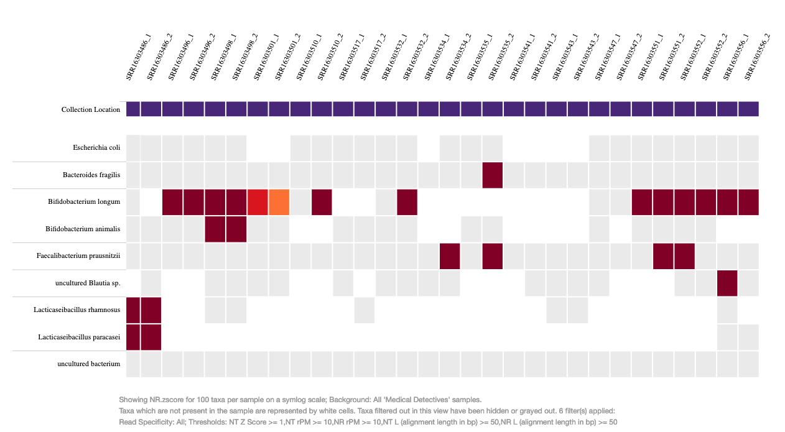
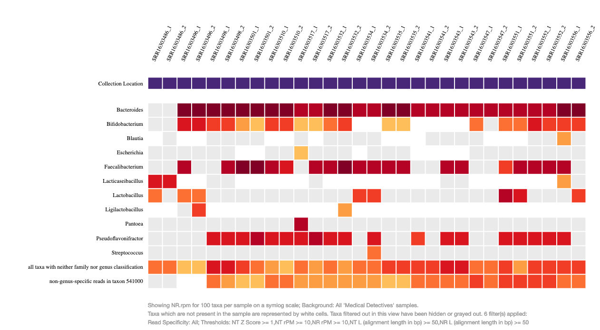
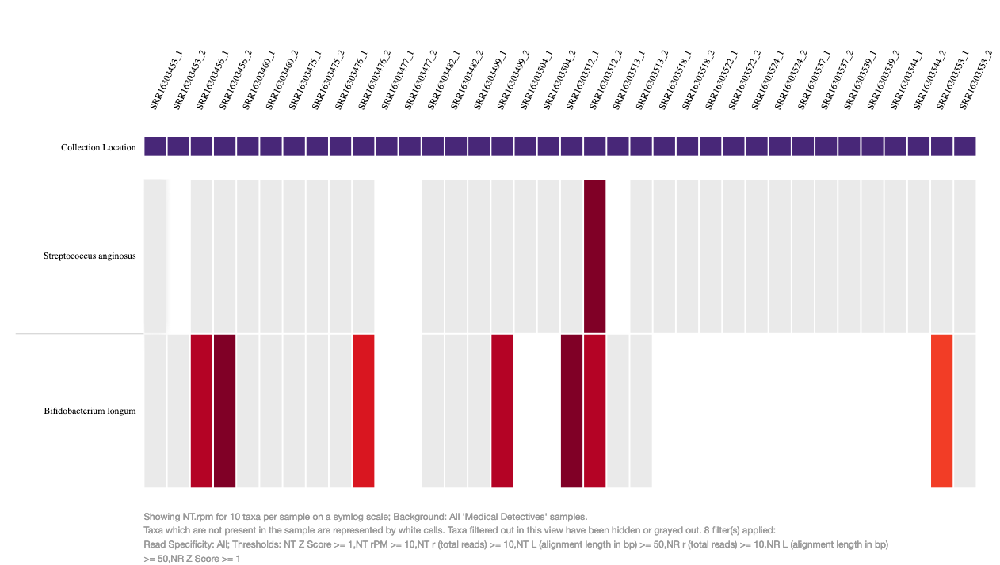
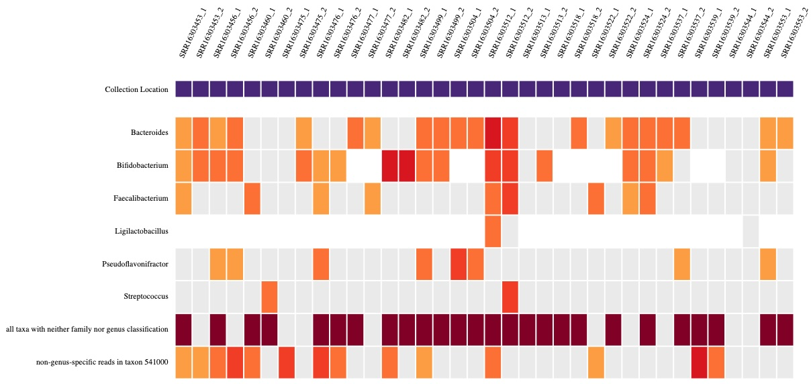

# advir
## ELUCIDATING THE CONTRIBUTION OF GUT MICROBIAL DIVERSITY TO ALZHEIMER'S DISEASE PHENOTYPES 

### General Overview

 Alzheimer's disease is a growing concern globally, and understanding its underlying mechanisms is crucial to developing effective intervention strategies. The gut-brain axis has emerged as a potential player in neurodegenerative diseases, including Alzheimer's, and this study aims to explore its role in more detail.
Using an existing gut-microbiome metagenomics dataset available from the NCBI, this study aims to elucidate the role of differential microbial diversity and composition, including bacteria, fungi, and viruses, in contributing to Alzheimer's disease phenotypes. The study will also assess potential gender-specific variations in microbial profiles that may contribute to the differential expression of Alzheimer's disease phenotypes.
The study's expected outcomes are promising, as it is anticipated to provide valuable insights into the intricate relationship between differential microbial diversity and Alzheimer's disease phenotypes. By analyzing an existing gut-microbiome metagenomics dataset from the NCBI, the study aims to validate and expand our understanding of the gut-brain axis's influence on neurodegenerative diseases. Furthermore, the gender-based analysis may unveil sex-specific microbial associations, shedding light on the differential expression of Alzheimer's disease phenotypes in men and women.
The implications of this study are significant, as unravelling the contribution of differential microbial diversity and composition in Alzheimer's disease phenotypes could have profound implications for disease management and therapeutic interventions. The identification of gender-specific variations in the gut microbiome may pave the way for personalized and targeted treatments tailored to each patient's microbial profile.
In conclusion, this study aims to contribute essential knowledge regarding the role of diverse microbial communities, including bacteria, fungi, and viruses, in shaping Alzheimer's disease phenotypes. Leveraging an existing gut-microbiome metagenomics dataset from the NCBI, the study anticipates generating significant data to advance our comprehension of the complex interplay between the gut microbiome and Alzheimer's disease. The findings may hold promise for future research avenues and clinical approaches aimed at harnessing the gut-brain axis for improved Alzheimer's disease management and patient outcomes.  
 

## Table of Contents
- [Introduction](#Introduction)
- [Objectives](#Objectives)
- [Methods](#Methods)
- [Results](#Results)
- [Team](#Team)
  
### [Introduction](#Introduction)

 Alzheimer’s disease (AD) is a progressive neurodegenerative disease that slowly errods memory and cognitive function, leading to impairment of daily activities and eventually death. It is the most common cause of dementia in older adults, accounting for up to 60-80% of all cases (Association, 2023; Association, 2022). AD is a complex disorder that involves multiple pathological processes, including the accumulation of beta-amyloid plaques, the formation of neurofibrillary tangles, and the loss of neurons and synapses in the brain (Herrup, 2015). While the exact cause of AD is not yet fully understood, studies have shown that genetics, lifestyle, and environmental factors may all play a role in the development of the disease (Dzianok & Kublik, 2023; Trepson, 2020; Galvin, 2017; Arab & Sabbagh, 2010; Harris, 2023; Joshi & Galvin, 2022).
Recent studies have shown a potential link between gut microbial diversity and AD, as well as the role of fungi and viruses in the development of the disease. Several studies have reported a decrease in gut microbial diversity in individuals with AD compared to healthy controls (Vogt et al., 2017; Zhang et al., 2017b; Vogt et al., 2018; Chen et al., 2023; Fan et al., 2020). This decrease in diversity may lead to changes in gut barrier function, inflammation, and immune dysregulation, which have been linked to AD pathology (Doulberis et al., 2021; Kowalski & Mulak, 2019; Bairamian et al., 2022; Bettcher et al., 2021; Padhi et al., 2022).
Furthermore, studies have suggested a potential role for fungi and viruses in AD pathology taking into account the infection hypothesis. In particular, the herpes simplex virus type 1 (HSV-1) has been implicated in the development of AD, as it is able to establish latent infections in the brain and may contribute to neuroinflammation and neuronal damage (Fulop et al., 2018; Forbes et al., 2019; Alonso et al., 2018; Ling et al., 2021; Whitson et al., 2022; Yadav et al., 2022a; Yadav et al., 2022b; Fox et al., 2019). Additionally, fungal infections such as Candida albicans have been linked to AD due to their ability to produce amyloid-beta peptides, which are a hallmark of AD pathology (Carter, 2017a; Bulgart et al., 2020; Kumar et al., 2016; Carter, 2017b).
Recent studies have shown that there are significant differences in the prevalence, risk factors, and clinical presentation of AD between the sexes. Moreover, there is emerging evidence that the differential gut microbial diversity observed in AD may be responsible for some of these differences, as well as the potential role of fungi and viruses (Wu et al., 2021; Dhami et al., 2023; Cuervo-Zanatta et al., 2021b; Shen & Ji, 2019). Studies have consistently shown that females have a higher prevalence of AD than males, with a greater risk of developing the disease and a more rapid progression of symptoms (Association, 2021; Mosconi et al., 2017). Furthermore, sex-specific risk factors, such as hormonal changes and genetic differences, may contribute to these differences (Laws et al., 2018; Dumitrescu et al., 2019; Frigerio et al., 2019; Mazure & Swendsen, 2016).
Recent studies have suggested that the gut microbiome may play a crucial role in these sex-specific differences. For instance, both human and animal studies have shown that gut microbial diversity is lower in females with AD compared to males with AD and healthy controls (Shobeiri et al., 2022; Cuervo-Zanatta et al., 2021a; Zhang et al., 2017a; Vogt et al., 2018; Kaur et al., 2021; Dutta et al., 2022; Yanguas-Casás et al., 2021). Furthermore, sex-specific differences in the gut microbiome have been associated with differences in brain structure and function in healthy individuals (Bridgewater et al., 2017). In addition to the potential role of the gut microbiome, studies have also suggested that fungi and viruses may contribute to sex-specific differences in AD pathology. For instance, the herpes simplex virus type 1 (HSV-1) has been implicated in the development of AD, with some evidence suggesting that the virus may have a greater impact on females than males (Itzhaki, 2014). Similarly, fungal infections such as Candida albicans have been linked to AD, with some evidence suggesting that the fungus may have a greater impact on females than males (Alonso et al., 2014).
Taking advantage of the current advancement in bioinformatic tools and metagenomics data the differential gut microbial landscape and the identification of differences based on sex can be elucidated. These tools can help identify potential roles of fungi, bacteria, and viruses in the development and progression of various diseases. Metagenomics data can also be used to generate functional profiles of the gut microbiome, which can provide insight into the metabolic pathways and potential functions of the microbiome (Sochocka et al., 2019; Chaudhari et al., 2023; Pasolli et al., 2017). Using these tools, researchers can compare the gut microbial landscape between males and females, identify differences in composition and function, and potentially identify the role of fungi, bacteria, and viruses in these differences (Bridgewater et al., 2017; Markle et al., 2013).
Given these findings, it is important to investigate the potential roles of the gut microbiome, fungi, and viruses in the sex-specific heterogeneity observed in AD phenotypes. Elucidating the potential mechanisms underlying these differences and aid in the development of targeted interventions. 
 

### [Objectives](#Objectives)

 This study aims to elucidate the role of differential microbial diversity and composition,
encompassing bacteria, fungi, and viruses, in contributing to Alzheimer's disease phenotypes
using an existing gut-microbiome metagenomics dataset available from the NCBI.
Additionally, we aim to discern potential gender-specific variations in microbial profiles that
may contribute to the differential expression of Alzheimer's disease phenotypes. 
 

### [Methods](#Methods)

#### Metagenomics Data Retreival Workflow

 

#### Analysis Workflow

 Adapted form czid (https://czid.org/)  
 

###  [Results](#Results)
#### Alzheimer's Disease Female Cases
#### Species Abundance

#### Genus Abundance

#### Alzheimer's Disease Female Controls
#### Species Abundance

#### Genus Abundance

### [Conclusion](#Conclusion)

 Our observations reveal notable disparities in the microbial composition of the gut microbiome between male and female AD cases, as well as between the control group and AD cases. These findings suggest a potential influence of these differences on the phenotype of the disease.

### [Team](#Team)
1. Edward J. Tettevi
2. Mark Kivumbi
3. Awe Olaitan

